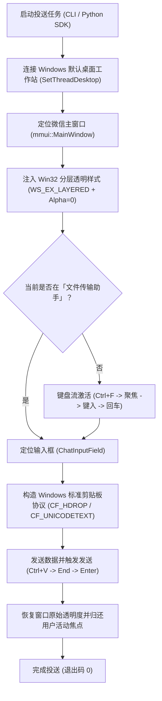

# 🚀 WeChat FileHelper Silent Delivery (微信文件传输助手静默直发工具)

<p align="center">
  
  
  
  
  
  
</p>

专为 **PC 微信 4.x（Qt / mmui 新架构）** 打造的生产级自动化投送工具。

利用 Windows 原生分层透明窗口（`WS_EX_LAYERED`）与纯键盘流（Zero-Click）UI 自动化技术，实现向电脑微信 **「文件传输助手」** **完全静默、不抢焦点、不闪烁屏幕** 地投送文件、多图海报、排版推文与文本消息。

专为各类 **AI 编码助手（Antigravity、Cursor、Claude Code、WorkBuddy、OpenCode）** 与 **自动化工作流（CI/CD、定时报表、爬虫产物）** 设计。

---

## 🌟 为什么选择本工具？（痛点终结）

| 痛点场景 | 传统工具（旧版 wxauto / 常见脚本） | 本工具（WeChat FileHelper Silent） |
| :--- | :--- | :--- |
| **微信 4.x (Qt) 兼容** | ❌ **大面积报废**。微信 4.x 采用 Qt 重构，常态下无搜索 EditControl，旧脚本找不到控件直接崩溃。 | ✅ **原生适配**。利用 `{Ctrl}f` 唤起浮层，自动捕获 `mmui::XValidatorTextEdit`。 |
| **前台抢焦点 / 闪烁** | ❌ **强行弹窗抢焦点**。用户在打字或全屏写代码时窗口突然弹起，严重打断工作流。 | ✅ **完全隐形静默**。Win32 分层窗口 `Alpha=0`，完全不抢焦点，发送完毕自动无感恢复用户原窗口。 |
| **透明模式下切会话** | ❌ **报「无法切换会话」**。老代码使用鼠标 `Click()`，在透明分层窗口下模拟鼠标点击失效。 | ✅ **全键盘流（Zero-Click）**。全程依靠 `SetFocus()` + `SendKeys`，规避鼠标限制，切会话成功率 100%。 |
| **账号封号安全** | ⚠️ Hook / 内存注入类工具存在极高封号风险，微信频繁更新时 DLL 即失效。 | ✅ **100% 账号零风险**。纯 Windows 官方 UIAutomation 与剪贴板协议（`CF_HDROP`），不碰内存，永不封号。 |

---

## 📐 核心架构与原理



---

## 🚀 快速上手

### 1. 安装系统依赖

> **注意**：仅支持 Windows 10 / 11 系统，且电脑微信客户端处于**已登录**状态。

```bash
pip install -r requirements.txt
```

### 2. 健康检查（一秒验证）

在开始调用前，建议运行自检命令确认微信环境正常：

```powershell
python send_to_wechat.py --check
```

若就绪将输出：
```text
[+] 微信检测正常：已就绪并可连接至文件传输助手。
```

---

## 💻 命令行 CLI 用法

本工具提供了极其丰富灵活的 CLI 选项，能够直接在终端、PowerShell 或各类 Shell 脚本中无缝调用：

### 模式 1：按顺序批量发送图片 / 文件
保证严格按照指定的先后顺序依次发送（特别适合多联海报、叙事推文配图等场景）：
```powershell
python send_to_wechat.py -f "D:\output\01.jpg" "D:\output\02.jpg" "D:\output\report.docx"
```

### 模式 2：发送纯文本消息（内联显示，方便手机复制）
```powershell
python send_to_wechat.py -t "【今日排版文案】正文内容已准备就绪..."
```

### 模式 3：直接将本地 txt 文本文件以消息形式发送
```powershell
python send_to_wechat.py --file-text "D:\output\公众号排版全文.txt"
```

### 模式 4：扫描目录通配符并按字母/数字升序发送
```powershell
python send_to_wechat.py -d "D:\output\poster_collection" --filter "*.png"
```

### 模式 5：结构化批处理 JSON 流水线
支持在一个配置文件中定义图文混合发送序列：
```powershell
python send_to_wechat.py -j "examples/batch_example.json"
```

*`batch_example.json` 格式示例：*
```json
[
  { "type": "text", "content": "🚀 【任务交付】今日数据报表如下：" },
  { "type": "file", "path": "D:\\data\\report.pdf" },
  { "type": "files", "paths": ["D:\\img\\01.png", "D:\\img\\02.png"] },
  { "type": "text", "content": "✨ 投送完成！" }
]
```

### 可选控制参数
- `--no-silent`：关闭全透明静默模式（调试时可在屏幕上直观查看操作全过程）。

---

## 🐍 Python 代码嵌入用法 (SDK)

你可以直接在 Python 自动化流水线或 AI Agent 脚本中将其作为上下文管理器导入使用：

```python
from wechat_filehelper import WeChatFileHelperSender

# 使用 with 语法，在退出时自动安全清理窗口句柄并恢复用户焦点
with WeChatFileHelperSender(target_chat="文件传输助手", silent=True) as sender:
    sender.send_text("🤖 [AI Agent] 任务构建完成，正在为您传送交付物：")
    sender.send_file(r"D:\output\final_report.docx")
    sender.send_file(r"D:\output\summary.png")
    sender.send_text("✅ 传送完成，请在移动端微信中查看。")
```

---

## 🛠️ 关键技术深度解析 (FAQ)

### Q1：为什么 win32gui 找不到 `mmui::MainWindow`？
在微信 4.x 中，Windows API `win32gui.GetClassName(hwnd)` 获取到的是底层的 Qt 类名（如 `Qt51514QWindowIcon`），而在微软官方 UIAutomation 体系下，该顶层窗口公开的 UIA ClassName 才是 `mmui::MainWindow`。本工具遵循微软 UIA 标准，因此请勿随意“修复”或更改匹配名称。

### Q2：为什么必须使用全键盘流，不能用鼠标 `control.Click()`？
为了达到“零打扰（Zero Disruption）”，我们在后台将微信窗口设置了 `WS_EX_LAYERED` 并且 `Alpha=0`（完全透明隐形）。在 Windows 系统中，合成的鼠标点击事件无法有效路由到完全透明的分层窗口上；但键盘事件（`SendKeys` 与 `SetFocus`）依然能够 100% 畅通送达。因此切会话必须采用 `Ctrl+F` 键盘流。

---

## 📄 开源许可证

本项目基于 [MIT License](LICENSE) 开源，欢迎自由用于个人日常、开源项目或商业自动化流程中。
