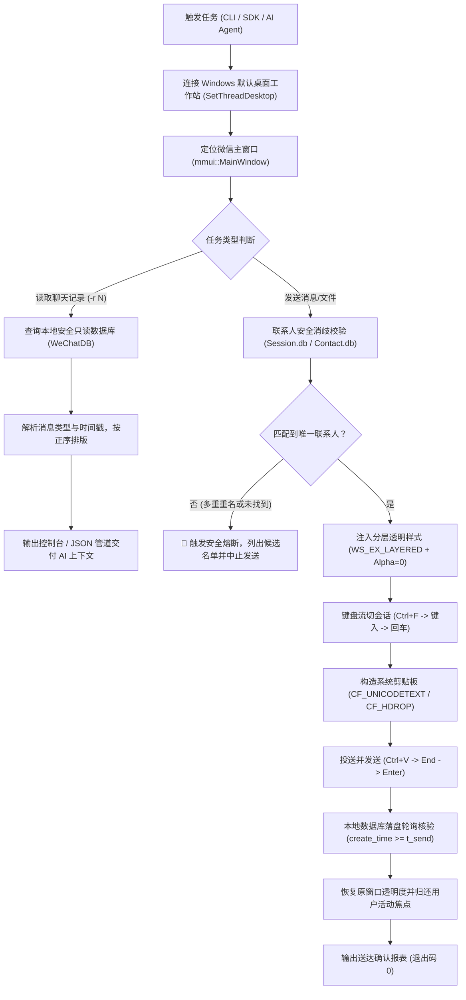

# 🚀 WeChat FileHelper Silent Delivery & Collaboration (微信文件传输助手与指定好友协作工具)

<p align="center">
  
  
  
  
  
  
  
</p>

专为 **PC 微信 4.x（Qt / mmui 新架构）** 打造的生产级自动化投送与好友协作工具。

利用 Windows 原生分层透明窗口（`WS_EX_LAYERED`）、纯键盘流（Zero-Click）UI 自动化与本地只读 SQLite/WCDB 数据库安全解密技术，实现向电脑微信 **「文件传输助手」** 或 **「指定微信好友 / 群聊」** **完全静默、不抢焦点、精准防误发、送达核验** 地投送文件、海报图集、排版推文与文本消息，并支持**按时间正序可靠读取好友聊天记录**。

专为各类 **AI 编码助手（Antigravity、Cursor、Claude Code、WorkBuddy、OpenCode）** 与 **自动化工作流（CI/CD、定时报表、自动化客服、智能助理）** 设计。

---

## 🌟 v2.0 重大更新特性 (What's New in v2.0)

1. **指定好友协作与防误发安全拦截 (`-c / --contact`)**：
   - 支持指定任意微信好友、备注名或群聊作为目标。
   - **重名与歧义联系人安全防线**：投送前主动匹配本地联系人库。如果查询到多个同名好友（或匹配项过多），工具**自动安全熔断并列出所有候选名称**，坚决杜绝“同名好友误发”事故。
2. **正序读取指定好友最新聊天记录 (`-r / --read`)**：
   - 提取指定好友最近 $N$ 条真实聊天记录，严格按时间正序排列（更符合人类阅读与 AI 理解上下文的习惯）。
   - 明确标注发送者身份（`[对方]` vs `[我]`）及精确时间戳。
   - **真实占位，绝不臆测**：图片、语音、视频、文件、表情包与系统拍一拍等非纯文本消息均输出明确的标准占位标记，拒绝模型幻觉。
3. **数据库级逐项送达闭环核验 (`Post-Send Verification`)**：
   - 拒绝“连接了微信就当作成功”的虚假上报；
   - 消息发出后自动轮询本地数据库确认真实落地入库，逐项向用户确认发送状态。
4. **100% 向下兼容**：
   - 未指定 `-c` 时默认目标依然为「文件传输助手」，原有脚本与自动化配置零修改无缝升级。

---

## 🆚 为什么选择本工具？（痛点终结）

| 痛点场景 | 传统工具（旧版 wxauto / 常见脚本） | 本工具（WeChat FileHelper Silent v2.0） |
| :--- | :--- | :--- |
| **微信 4.x (Qt) 兼容** | ❌ **大面积报废**。微信 4.x 采用 Qt 重构，常态下无搜索 EditControl，旧脚本找不到控件直接崩溃。 | ✅ **原生适配**。利用 `{Ctrl}f` 唤起浮层，自动捕获 `mmui::XValidatorTextEdit`。 |
| **前台抢焦点 / 闪烁** | ❌ **强行弹窗抢焦点**。用户在打字或全屏写代码时窗口突然弹起，打断工作流。 | ✅ **完全隐形静默**。Win32 分层窗口 `Alpha=0`，完全不抢焦点，发送完毕无感恢复用户原活动窗口。 |
| **同名好友误发风险** | ❌ **直接盲发**。搜出谁就发给谁，极易将机密文件误发给同名客户或前同事。 | ✅ **数据库级防误发拦截**。预检匹配项，重名或无匹配时立即中止并提示歧义。 |
| **读取消息能力** | ❌ 仅支持前台滚动截图 OCR 或无法获取。 | ✅ **本地只读安全读取**。极速解密提取最近 $N$ 条历史，支持格式化打印或 `--json` 管道传输。 |
| **送达状态确认** | ❌ 盲按回车即认为成功，界面被拦截时不知情。 | ✅ **入库级真实校验**。轮询确认消息落地本地 SQLite，确认送达。 |
| **账号封号安全** | ⚠️ Hook / 内存注入类工具存在极高封号风险，微信一更新即失效。 | ✅ **100% 账号零风险**。纯 Windows 官方 UIAutomation 与剪贴板协议（`CF_HDROP`），只读解密，不碰内存，永不封号。 |

---

## 📐 核心架构与协作时序



---

## 🚀 快速上手

### 1. 安装系统依赖

> **系统要求**：Windows 10 / 11 64位系统，已安装 PC 微信客户端（支持微信 4.x 最新版）并处于**已登录**状态。

```bash
git clone https://github.com/lzhangwei983/wechat-filehelper-silent.git
cd wechat-filehelper-silent
pip install -r requirements.txt
```

### 2. 环境健康自检

在日常使用前，运行自检命令确认微信环境与窗口句柄状态：

```powershell
python send_to_wechat.py --check
```

若就绪将输出：
```text
[+] 微信主窗口句柄已定位: HWND 199868 (mmui::MainWindow)
[+] 微信检测正常：已就绪并可连接至文件传输助手。
```

---

## 💻 命令行 CLI 完整指南

### 1. 读取好友最新聊天记录 (`-r / --read`)

#### 读取张三最近 5 条聊天消息：
```powershell
python send_to_wechat.py -c "张三" -r 5
```
输出示例：
```text
============================================================
📅 聊天记录: 张三 (共 5 条，按时间正序)
============================================================
[2026-09-23 20:30:12] [对方]: 明天上午的技术评审PPT准备好了吗？
[2026-09-23 20:31:05] [我]: 已经在收尾了，稍后把预览图发你确认。
[2026-09-23 20:32:00] [对方]: [图片]
[2026-09-23 20:32:45] [对方]: 参照这个排版风格调整一下标题。
[2026-09-23 20:33:10] [我]: 收到，这就安排。
============================================================
```

#### 以 JSON 格式输出（供自动化脚本与 AI 解析）：
```powershell
python send_to_wechat.py -c "张三" -r 5 --json
```

---

### 2. 发送消息给指定好友 (`-c / --contact`)

#### 发送纯文本消息给好友：
```powershell
python send_to_wechat.py -c "张三" -t "您好，这是修改后的最新方案，请查收。"
```

#### 发送单张或多张图片/文件给好友（严格保序）：
```powershell
python send_to_wechat.py -c "张三" -f "D:\output\design_v2.png" "D:\output\report.docx"
```

#### 带有歧义拦截保护演示：
若输入模糊名称 `-c "群"`，系统检测到存在多个匹配项时，会自动拦截：
```text
[!] 错误: 联系人 '群' 存在多位匹配项，为防止误发已安全拦截:
  - 技术交流群
  - 核心开发群
  - 市场推广群
请在 -c 参数中指定更精确的完整昵称或备注名。
```

---

### 3. 文件传输助手经典功能（100% 保持原有习惯）

不带 `-c` 参数时，默认目标始终为 **「文件传输助手」**：

#### 发送文件与图片合集：
```powershell
python send_to_wechat.py -f "D:\output\01.jpg" "D:\output\02.jpg"
```

#### 发送排版长文本文件（如公众号文章草稿）：
```powershell
python send_to_wechat.py --file-text "D:\output\微信推文排版.txt"
```

#### 遍历目录批量发送：
```powershell
python send_to_wechat.py -d "D:\output\posters" --filter "*.png"
```

#### 批处理流水线配置文件 (`-j / --json-file`)：
```powershell
python send_to_wechat.py -j "examples/batch_example.json"
```

---

## 🐍 Python 代码嵌入用法 (SDK)

在 Python 项目中，你可以直接导入 `WeChatAssistant`（或向下兼容别名 `WeChatFileHelperSender`）：

```python
from wechat_filehelper import WeChatAssistant

# 场景 1：与指定好友协作
with WeChatAssistant(target_chat="张耿", silent=True) as assistant:
    # 1. 读取最近 5 条消息了解背景需求
    history = assistant.read_messages(limit=5)
    for msg in history:
        print(f"[{msg['time_str']}] {msg['sender_name']}: {msg['content']}")
    
    # 2. 发送工作答复与文件
    assistant.send_text("收到您的需求，这是刚生成的最终版海报：")
    assistant.send_file(r"D:\output\final_poster.png", verify=True)
    assistant.send_text("已通过数据库入库验证，请查收！")

# 场景 2：默认发送至文件传输助手
with WeChatAssistant() as assistant:
    assistant.send_file(r"D:\data\daily_backup.zip")
```

---

## ⚙️ CLI 完整参数对照表

| 参数 | 缩写 | 默认值 | 说明 |
| :--- | :--- | :--- | :--- |
| `--contact` | `-c` | `文件传输助手` | 目标联系人/好友昵称/群聊名称。若存在同名歧义则自动拦截保护。 |
| `--read` | `-r` | `None` | 读取指定联系人最近 $N$ 条历史聊天记录，按时间正序展示。 |
| `--json` | 无 | `False` | 配合 `--read` 使用，以 JSON 格式输出消息数组供管道读取。 |
| `--text` | `-t` | `None` | 发送指定的纯文本字符串。 |
| `--files` | `-f` | `None` | 发送一个或多个本地文件/图片，空格分隔，严格保持顺序。 |
| `--file-text` | 无 | `None` | 读取本地指定 `.txt` 文件内容并作为多段排版文本直发。 |
| `--dir` | `-d` | `None` | 扫描指定目录下的文件并按字母升序依次发送。 |
| `--filter` | 无 | `*.*` | 配合 `--dir` 使用的文件通配符过滤模式（例如 `*.jpg`、`*.pdf`）。 |
| `--json-file` | `-j` | `None` | 读取 JSON 批处理作业文件执行组合流水线任务。 |
| `--check` | 无 | `False` | 仅检查微信运行与主窗口句柄状态，不执行任何发送。 |
| `--no-silent` | 无 | `False` | 临时禁用全透明静默模式，方便桌面调试。 |

---

## 🛠️ 技术深度解析 (FAQ)

### Q1：为什么 win32gui 找不到 `mmui::MainWindow`？
在微信 4.x 中，Windows API `win32gui.GetClassName(hwnd)` 获取到的是底层的 Qt 窗口类名（如 `Qt51514QWindowIcon`），而在微软官方 UIAutomation 体系下，该顶层窗口公开的 UIA ClassName 才是 `mmui::MainWindow`。本工具综合了 Win32 原生 API 与 UIAutomation 标准，能够无感秒级定位窗口句柄。

### Q2：消息读取是如何做到既安全又不被封号的？
本工具的消息读取能力基于本地只读数据库解密机制（利用 Windows 内存中微信合法运行时的只读句柄读取本地 SQLite / WCDB 缓存库），完全在本地离线读取，不向微信注入任何 Hook 代码、不篡改任何网络通信包，与微信服务器无额外交互，彻底消除封号风险。

### Q3：为什么搜索会话使用全键盘流？
在 Windows 系统中，设置了 `WS_EX_LAYERED` 且 `Alpha=0`（完全隐形）的窗口，合成的鼠标点击事件无法被分发；但 Windows 键盘流（`SetFocus` + `keybd_event`）能够 100% 畅通送达。因此切会话采用全键盘流，保证了 100% 成功率且对用户毫无视觉干扰。

---

## 📄 开源许可证

本项目基于 [MIT License](LICENSE) 开源，欢迎自由用于个人日常、AI Agent 体系或商业自动化流程中。
