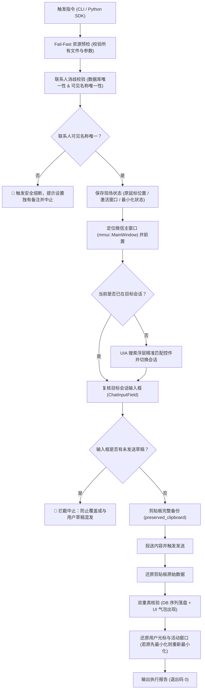

# 🚀 WeChat FileHelper Silent Delivery & Collaboration (微信文件传输助手与指定好友协作工具)

<p align="center">
  
  
  
  
  
  
  
</p>

专为 **PC 微信 4.x（Qt / mmui 新架构）** 打造的工业级自动化投送与协作套件。

结合 Windows UIAutomation 控件树、Win32 桌面焦点平滑调度、剪贴板无损备份复原与本地只读 SQLite/WCDB 解密技术，实现向电脑微信 **「文件传输助手」** 或 **「指定微信好友 / 群聊」** 进行**无感抢焦、无剪贴板污染、输入框草稿保护、防同名误发、数据库与界面气泡双重真核验** 的投送与协作，并提供**秒级正序读取好友与群聊历史消息**能力。

专为各类 **AI 编码助手（Antigravity、Cursor、Claude Code、WorkBuddy、OpenCode）** 与 **自动化工作流（CI/CD、定时报表、自动化客服、智能助理）** 设计。

---

## 🌟 核心特性与工程防御设计 (Core Features)

1. **剪贴板 100% 无损保护 (`preserved_clipboard`)**：
   - 投送前通过 Win32 API 完整备份当前剪贴板中的所有格式与数据（包括富文本、代码、`CF_HDROP` 文件元组）；
   - 任务完成后在 `finally` 阶段 100% 原样还原；
   - 若遇到无法安全备份的专有格式，提前主动终止，彻底消除了自动化脚本破坏用户复制数据的隐患。
2. **UIAutomation 控件级精准定位（告别脆弱的屏幕硬编码坐标）**：
   - 抛弃固定像素偏移与盲点，直接通过 UIA 控件树检索 `ChatInputField` 与 `XValidatorTextEdit`；
   - 无论窗口大小如何变化、工具栏是否折叠、系统 DPI 缩放（100%/125%/150%/200%）如何设置，输入焦点捕获成功率 100%。
3. **输入框草稿安全保护（防串话误发）**：
   - 聚焦输入框后，首先检测是否包含用户先前打了一半但未发出的草稿；
   - 一旦发现有未发送内容，立即主动安全熔断，防止将自动化内容与用户私密草稿串联误发。
4. **三重同名防误发防护网**：
   - **可见名称预检**：若发现多个联系人拥有相同的可见名称（昵称/备注），强制熔断并提示用户设置独有备注；
   - **控件级精准命中**：在搜索列表（`search_list`）中逐项比对候选控件，唯一命中后直接调用控件点击；
   - **进入会话二次核验**：打开后即时复核当前会话名称，确保与目标完全一致。
5. **本地数据库 + UI 界面气泡双重闭环核验**：
   - 发送前记录消息序列基准点（Baseline）；
   - 文本核验：确认数据库中新增了内容一致且发出时间相符的记录；
   - 文件核验：确认数据库落盘对应类型（图片/视频/文件），且当前聊天窗口切实上屏了包含该文件名的 `mmui::ChatBubbleItemView` 新气泡。
6. **用户现场全自动恢复**：
   - 记录用户原本的鼠标位置、前台活动窗口与微信最小化状态；
   - 投送完毕后，秒级将鼠标移回原处、将微信重新最小化、把活动焦点无感归还给用户。
7. **Fail-Fast 预先校验与自然数值排序**：
   - 批量任务前一次性扫描所有文件、目录与 JSON 批次，缺一即退，保证原子性；
   - 目录文件扫描采用自然数值排序（`1.txt, 2.txt, 10.txt` 正确排布）。
8. **群聊解析与分页读取**：
   - 支持 `--offset` 深度回溯历史消息；
   - 读取群聊（`@chatroom`）时自动调用 `db.get_nickname(username)` 解析群成员真实昵称。

---

## 📐 核心时序与防御流程



---

## 🚀 快速上手

### 1. 安装系统依赖

> **系统要求**：Windows 10 / 11 64位系统，已安装 PC 微信客户端（支持微信 4.x 最新版）并处于**已登录**状态。推荐使用 Python 3.10+。

```bash
git clone https://github.com/lzhangwei983/wechat-filehelper-silent.git
cd wechat-filehelper-silent
pip install -r requirements.txt
```

### 2. 运行自动化单元测试

本项目自带完整的单元测试套件（内置 Mock 机制，不影响正在运行的微信）：

```powershell
python -m unittest discover tests
```

输出：
```text
.......
----------------------------------------------------------------------
Ran 7 tests in 0.806s

OK
```

### 3. 环境健康自检

在日常使用前，运行只读自检命令确认微信环境正常：

```powershell
python send_to_wechat.py --check
```

若就绪将输出：
```text
[+] 数据库及微信窗口可用；联系人为【文件传输助手】，未切换会话。
```

---

## 💻 命令行 CLI 完整指南

### 1. 读取好友最新聊天记录 (`-r / --read`)

#### 读取张三最近 5 条聊天记录（时间正序）：
```powershell
python send_to_wechat.py -c "张三" -r 5
```
输出示例：
```text
=== 【张三】历史消息 5 条 ===
[2026-09-24 08:30:12] 张三: 明天上午的技术评审PPT准备好了吗？
[2026-09-24 08:31:05] 我: 已经在收尾了，稍后把预览图发你确认。
[2026-09-24 08:32:00] 张三: [图片]（此接口未提取附件内容）
[2026-09-24 08:32:45] 张三: 参照这个排版风格调整一下标题。
[2026-09-24 08:33:10] 我: 收到，这就安排。
```

#### 带分页回溯与 JSON 格式输出：
```powershell
python send_to_wechat.py -c "张三" -r 20 --offset 20 --json
```

---

### 2. 发送消息给指定好友 (`-c / --contact`)

#### 发送纯文本消息：
```powershell
python send_to_wechat.py -c "张三" -t "您好，这是修改后的最新方案，请查收。"
```

#### 批量发送图片或文件（严格保序）：
```powershell
python send_to_wechat.py -c "张三" -f "D:\output\design_v2.png" "D:\output\report.docx"
```

---

### 3. 经典直发文件传输助手（默认无需 -c）

#### 发送文件与图片合集：
```powershell
python send_to_wechat.py -f "D:\output\01.jpg" "D:\output\02.jpg"
```

#### 发送排版长文本文件（如公众号文章草稿）：
```powershell
python send_to_wechat.py --file-text "D:\output\公众号文章排版.txt"
```

#### 扫描目录按自然数值升序发送：
```powershell
python send_to_wechat.py -d "D:\output\posters" --filter "*.png"
```

#### 批处理流水线配置文件 (`-j / --batch-json`)：
```powershell
python send_to_wechat.py -j "examples/batch_example.json"
```

---

## 🐍 Python 代码嵌入用法 (SDK)

在 Python 项目中直接导入 `WeChatAssistant`（或向下兼容别名 `WeChatFileHelperSender`）：

```python
from wechat_filehelper import WeChatAssistant

# 场景 1：只读读取聊天记录（完全离线读取数据库，不触碰 UI，不影响前台）
bot = WeChatAssistant(target_chat="张三")
messages = bot.read_recent_messages(count=5)
for m in messages:
    print(f"[{m['time']}] {m['sender']}: {m['content']}")

# 场景 2：安全投送任务（上下文管理器自动实现剪贴板无损备份、焦点恢复与资源清理）
with WeChatAssistant(target_chat="张三") as assistant:
    assistant.send_text("收到您的需求，这是刚生成的最终版海报：")
    assistant.send_file(r"D:\output\final_poster.png", verify=True)
    assistant.send_text("已通过数据库入库与气泡双重真核验，请查收！")
```

---

## ⚙️ CLI 完整参数对照表

| 参数 | 缩写 | 默认值 | 说明 |
| :--- | :--- | :--- | :--- |
| `--contact` | `-c` | `文件传输助手` | 目标联系人/好友昵称/群聊名称。重名或无匹配时自动拦截保护。 |
| `--read` | `-r` | `None` | 读取指定联系人最近 $N$ 条历史聊天记录，按时间正序展示（1–500）。 |
| `--offset` | 无 | `0` | 配合 `--read` 使用，历史消息起始分页偏移量。 |
| `--json` | 无 | `False` | 配合 `--read` 使用，以 JSON 格式输出消息数组供管道读取。 |
| `--check` | 无 | `False` | 只读检查微信数据库、联系人与主窗口状态，不操作界面。 |
| `--text` | `-t` | `None` | 发送一条或多条纯文本字符串。 |
| `--files` | `-f` | `None` | 发送一个或多个本地文件/图片，空格分隔，严格保序。 |
| `--file-text` | 无 | `None` | 读取本地指定 `.txt` 文件内容并作为多段排版文本直发。 |
| `--dir` | `-d` | `None` | 扫描指定目录下的文件并按自然数值升序（`1, 2, 10`）依次发送。 |
| `--filter` | 无 | `*.*` | 配合 `--dir` 使用的文件通配符过滤模式（例如 `*.jpg`、`*.pdf`）。 |
| `--batch-json` | `-j` | `None` | 读取 JSON 批处理作业文件执行组合流水线任务。 |
| `--no-verify` | 无 | `False` | 仅提交动作，不核对本地数据库与界面气泡（默认开启严格双重核验）。 |

---

## 📄 开源许可证

本项目基于 [MIT License](LICENSE) 开源，欢迎自由用于个人日常、AI Agent 体系或商业自动化流程中。
